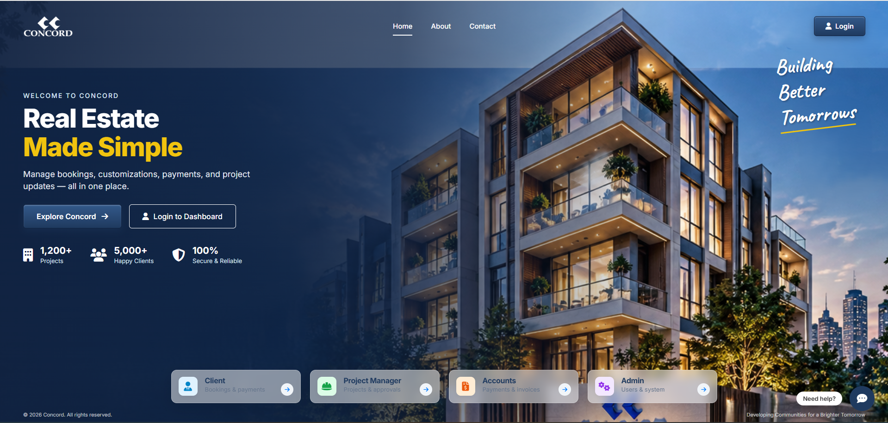
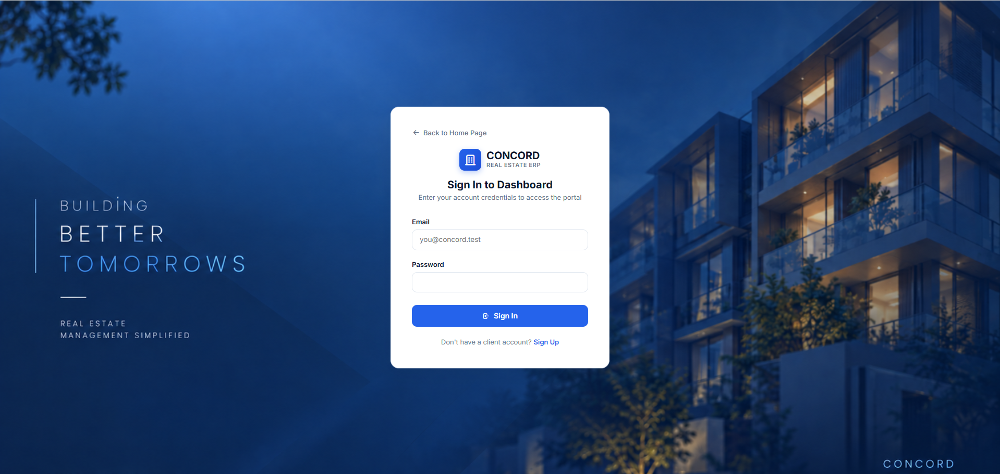
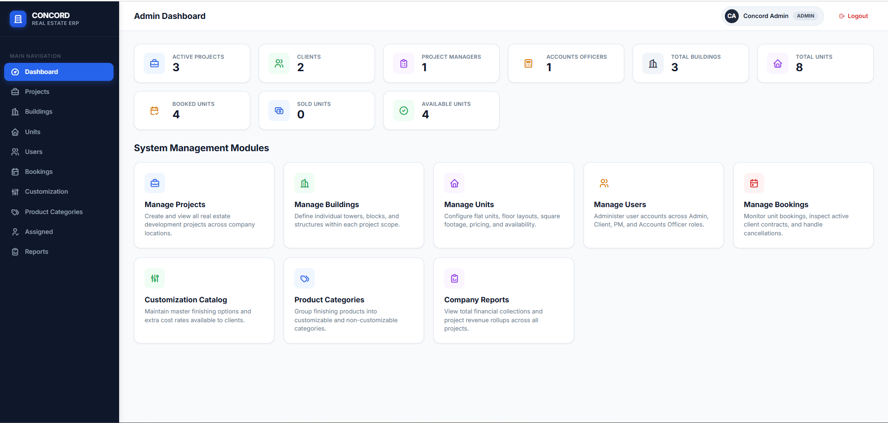
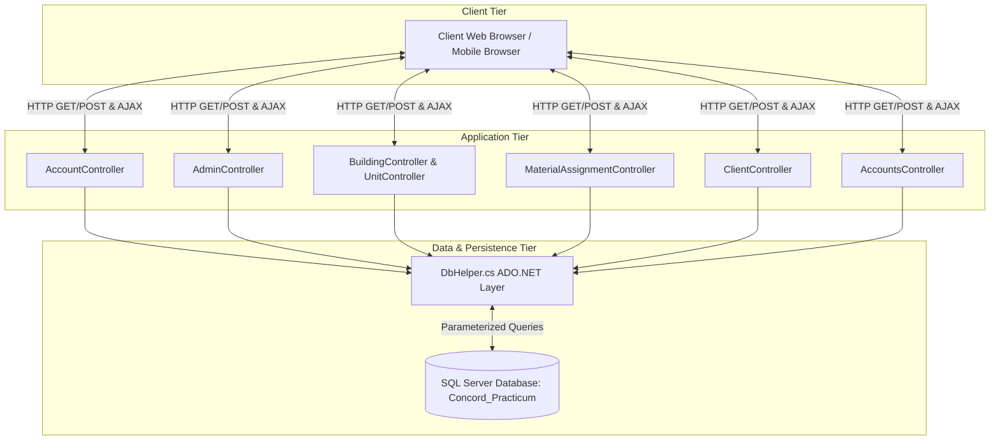
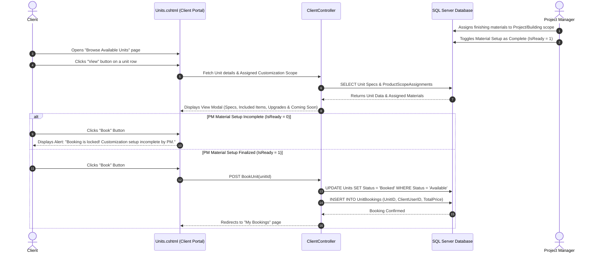
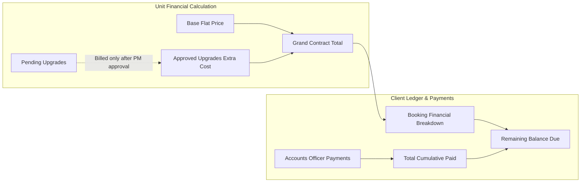

# Concord Real Estate Project Management & Apartment Customization System

Welcome to the **Concord Real Estate Project Management & Apartment Customization ERP System**. This enterprise-grade ASP.NET MVC solution manages real estate developments, building construction hierarchies, apartment unit allocations, client customization workflows, and financial payment ledgers.

---

## 📌 Executive Overview

The system acts as a multi-tenant operational portal for real estate development:
1. **Administrative Catalog Control**: Manages system users and standard product/material master catalogs.
2. **Project Manager Workflow**: Oversees projects, multi-story building structures, bulk unit inventory generation, scope assignment of finishing materials, and material setup readiness gates.
3. **Client Portal**: Allows clients to view available units, inspect assigned specifications and finishing options, book units (when PM readiness is finalized), pick material upgrades, and track payment schedules.
4. **Accounts Management**: Tracks client payment installments, generates printable receipts, and computes project revenue ledgers.

---

## 🖼️ User Interface Screenshots

### 1. Home Landing Page


### 2. Authentication & Login Portal


### 3. ERP Dashboard Interface


---

## 🏗️ Technology Stack & Architecture

- **Backend Framework**: ASP.NET MVC 5 (.NET Framework 4.8)
- **Database Engine**: Microsoft SQL Server (`Concord_Practicum`)
- **Data Access Layer**: `DbHelper.cs` (ADO.NET provider with parameterized SQL queries for optimal speed & SQL injection protection)
- **Frontend & Styling**: Vanilla CSS design system with custom CSS variables, tabler icons, card-based responsive tables, and clean bootstrap modals (`dashboard.css`)
- **Authentication & Security**: SHA-256 password hashing (`PasswordHasher.cs`), Session-based RBAC (Role-Based Access Control)

---

## 👥 User Roles & Access Control

| Role | Core Responsibilities |
| :--- | :--- |
| **Admin** | User account management, Master product catalog configuration, Master categories (Customizable vs Non-Customizable), system monitoring |
| **Project Manager** | Project & Building CRUD, Unit inventory generation (single & floor template bulk generation), Scope assignments, PM Material Readiness Gate |
| **Client** | Browse available units, View modal specifications, Book units (gated by PM setup completion), Apartment customization selection, Payment history tracking |
| **Accounts Officer** | Record installment collections, Issue client payment receipts, Monitor project revenue accounting ledgers & collection rollups |

---

## 🔄 End-to-End Data Flow Diagrams

### 1. High-Level System Architecture Flow


### 2. Client Unit Inspection, PM Readiness Gate & Booking Sequence


### 3. Customization Upgrade & Payment Calculation Flow


---

## 🖥️ Screen Overview & User Workflows

### 1. Available Units Portal (`/Client/Units`)
- **View Modal**: Clicking **View** opens a rich dialog showing:
  - **Unit Specifications**: Flat number, Floor, SqFt size, Facing direction, Bedroom/Bathroom breakdown, Balconies, Est. completion date, and Base Flat Price.
  - **Material Setup Status Banner**: Highlights whether Project Manager setup is finalized or in progress.
  - **Finishing Materials & Customizations**: Grouped by category (Standard Included materials, Included Defaults, Premium Upgrades with `+Tk/sqft` rates, and "Options Coming Soon" indicators).
- **Book Action**:
  - Unlocked when PM material setup is complete.
  - Locked (with lock icon `<i class="ti ti-lock"></i>` and alert notice) when PM setup is pending.

### 2. My Bookings & Customizations (`/Client/MyBookings`)
- Displays all active unit bookings for the logged-in client.
- **Customize Modal**: Allows clients to select material options (flooring, tiles, sanitary fittings, paints) with real-time price updates.

### 3. Payment History & Financial Breakdown (`/Client/Payments`)
- **KPI Summary Cards**: Total Contract Value, Total Amount Paid, Remaining Balance Due.
- **Booking Financial Breakdown**: Lists Booking #, Project Name, Building Name, Flat #, Total Price, Paid Amount, and Balance Due.
- **Payment Transaction History**: Lists payment date, Project Name, Building Name, Flat #, Amount Paid, and direct link to printable receipts.

### 4. Project Manager Scope Assignment (`/MaterialAssignment`)
- Selects project and building scopes to assign structural materials and customizable variants.
- Toggles the **PM Readiness Gate** (`MaterialAssignmentStatus.IsReady`) to open booking for clients.

---

## 🛠️ Build & Installation Guide

### System Requirements
- Operating System: Windows 10 / 11 / Server 2016+
- Framework: Microsoft .NET Framework 4.8
- Compiler: `csc.exe` (MSBuild C# Compiler)
- Web Server: IIS Express or Local IIS Server
- Database: Microsoft SQL Server (Database name: `Concord_Practicum`)

### Build Steps
1. Open PowerShell or Command Prompt in the project directory:
   ```cmd
   cd "f:\downloads\Defense 2\Defense 2\Final"
   ```
2. Execute the automated build batch script:
   ```cmd
   build.bat
   ```
   *(Ensure Exit Code is 0)*

3. Launch IIS Express locally:
   ```cmd
   "C:\Program Files\IIS Express\iisexpress.exe" /path:"f:\downloads\Defense 2\Defense 2\Final" /port:5000
   ```
4. Access the web application in your browser at `http://localhost:5000/`.

---

## 🔑 Default Test Credentials

| Role | Email | Password |
| :--- | :--- | :--- |
| **Admin** | `admin@concord.test` | `Test@123` |
| **Project Manager** | `pm@concord.test` | `Test@123` |
| **Client** | `client@concord.test` | `Test@123` |
| **Accounts Officer** | `accounts@concord.test` | `Test@123` |
